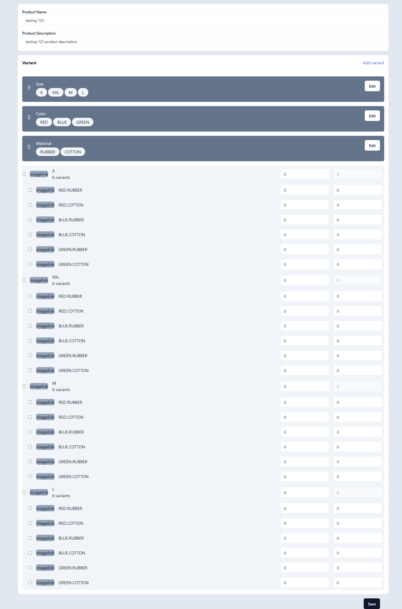
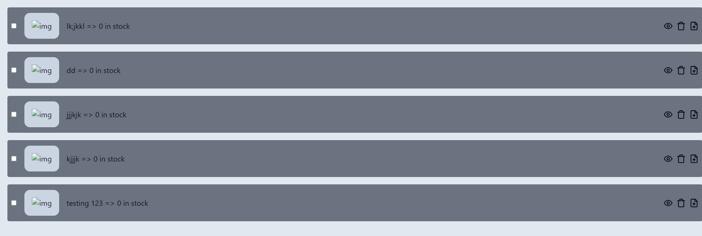

# Shopify-like Add Product Variant Functionality

## Description
This project aims to replicate Shopify's functionality for adding products and their variants using React.js. Users can add products along with their variants, manage product details such as price and stock, and view/manage products seamlessly.

## Features
- Add new products with multiple variants
- Specify price and stock for each product variant
- Manage existing products
- Intuitive user interface for easy navigation

## Screenshots

## Installation
1. Clone the repository: `git clone https://github.com/pritkheni/frontend.git`
2. Navigate to the project directory: `cd frontend`
3. Install dependencies: `npm install`
4. Start the development server: `npm run dev`

## Usage
- Once the server is running, open your web browser and navigate to `http://localhost:5173`.
- Use the provided interface to add new products, manage existing products, and view product details.

## Technologies Used
- React.js
- Shadcn
- Context API for sharing form data among components

## Contributing
Contributions are welcome! If you'd like to contribute to this project, please follow these steps:
1. Fork the project
2. Create your feature branch: `git checkout -b feature/NewFeature`
3. Commit your changes: `git commit -am 'Add some feature'`
4. Push to the branch: `git push origin feature/NewFeature`
5. Submit a pull request
